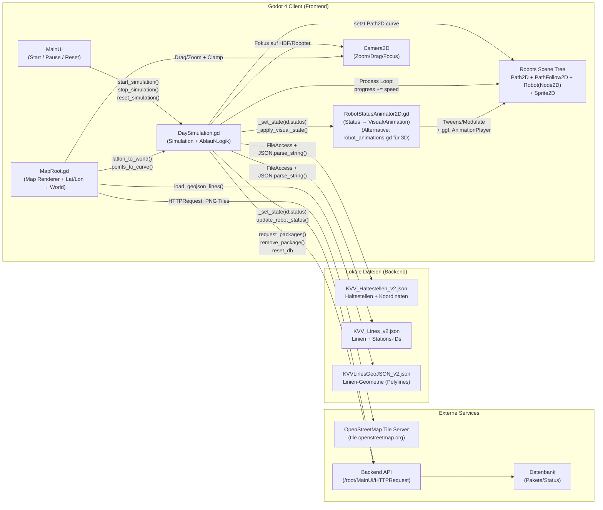

```mermaid
flowchart LR
  %% =========================
  %% GODOT CLIENT / FRONTEND
  %% =========================
  subgraph Godot["Godot 4 Client (Frontend)"]
    UI["MainUI\n(Start / Pause / Reset)"]
    Sim["DaySimulation.gd\n(Simulation + Ablauf-Logik)"]
    Map["MapRoot.gd\n(Map Renderer + Lat/Lon → World)"]
    Robots["Robots Scene Tree\nPath2D + PathFollow2D + Robot(Node2D)\n+ Sprite2D"]
    Anim["RobotStatusAnimator2D.gd\n(Status → Visual/Animation)\n(Alternative: robot_animations.gd für 3D)"]
    Cam["Camera2D\n(Zoom/Drag/Focus)"]
  end

  %% =========================
  %% LOCAL DATA
  %% =========================
  subgraph Local["Lokale Dateien (Backend)"]
    Stops["KVV_Haltestellen_v2.json\nHaltestellen + Koordinaten"]
    Lines["KVV_Lines_v2.json\nLinien + Stations-IDs"]
    Geo["KVVLinesGeoJSON_v2.json\nLinien-Geometrie (Polylines)"]
  end

  %% =========================
  %% EXTERNAL SERVICES
  %% =========================
  subgraph External["Externe Services"]
    Tiles["OpenStreetMap Tile Server\n(tile.openstreetmap.org)"]
    API["Backend API\n(/root/MainUI/HTTPRequest)"]
    DB["Datenbank\n(Pakete/Status)"]
  end

  %% UI -> SIM
  UI -->|"start_simulation()\nstop_simulation()\nreset_simulation()"| Sim

  %% SIM reads backend JSON
  Sim -->|"FileAccess + JSON.parse_string()"| Stops
  Sim -->|"FileAccess + JSON.parse_string()"| Lines

  %% MAP reads GeoJSON + loads tiles
  Map -->|"load_geojson_lines()"| Geo
  Map -->|"HTTPRequest: PNG Tiles"| Tiles

  %% SIM uses MAP helpers
  Map -->|"latlon_to_world()\npoints_to_curve()"| Sim

  %% SIM moves robots
  Sim -->|"setzt Path2D.curve"| Robots
  Sim -->|"Process Loop:\nprogress += speed"| Robots

  %% STATUS PIPELINE (lokal)
  Sim -->|"_set_state(id,status)\n_apply_visual_state()"| Anim
  Anim -->|"Tweens/Modulate\n+ ggf. AnimationPlayer"| Robots

  %% STATUS PIPELINE (remote)
  Sim -->|"_set_state(id,status)\nupdate_robot_status()"| API
  Sim -->|"request_packages()\nremove_package()\nreset_db"| API
  API --> DB

  %% Camera control
  Sim -->|"Fokus auf HBF/Roboter"| Cam
  Map -->|"Drag/Zoom + Clamp"| Cam
```