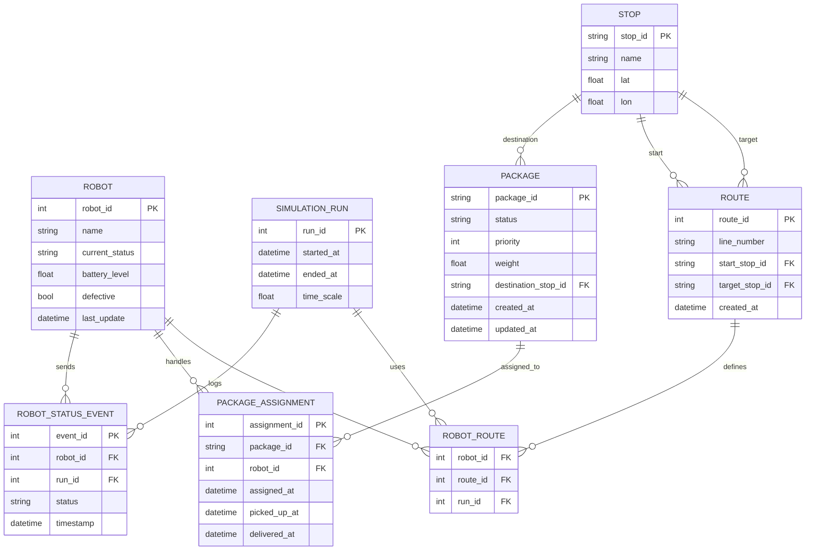

```mermaid
erDiagram
    ROBOT ||--o{ ROBOT_STATUS_EVENT : sends
    SIMULATION_RUN ||--o{ ROBOT_STATUS_EVENT : logs

    ROBOT ||--o{ PACKAGE_ASSIGNMENT : handles
    PACKAGE ||--o{ PACKAGE_ASSIGNMENT : assigned_to

    STOP ||--o{ PACKAGE : destination
    STOP ||--o{ ROUTE : start
    STOP ||--o{ ROUTE : target

    SIMULATION_RUN ||--o{ ROBOT_ROUTE : uses
    ROBOT ||--o{ ROBOT_ROUTE : follows
    ROUTE ||--o{ ROBOT_ROUTE : defines

    ROBOT {
      int robot_id PK
      string name
      string current_status
      float battery_level
      bool defective
      datetime last_update
    }

    PACKAGE {
      string package_id PK
      string status
      int priority
      float weight
      string destination_stop_id FK
      datetime created_at
      datetime updated_at
    }

    STOP {
      string stop_id PK
      string name
      float lat
      float lon
    }

    ROUTE {
      int route_id PK
      string line_number
      string start_stop_id FK
      string target_stop_id FK
      datetime created_at
    }

    SIMULATION_RUN {
      int run_id PK
      datetime started_at
      datetime ended_at
      float time_scale
    }

    ROBOT_STATUS_EVENT {
      int event_id PK
      int robot_id FK
      int run_id FK
      string status
      datetime timestamp
    }

    PACKAGE_ASSIGNMENT {
      int assignment_id PK
      string package_id FK
      int robot_id FK
      datetime assigned_at
      datetime picked_up_at
      datetime delivered_at
    }

    ROBOT_ROUTE {
      int robot_id FK
      int route_id FK
      int run_id FK
    }
```